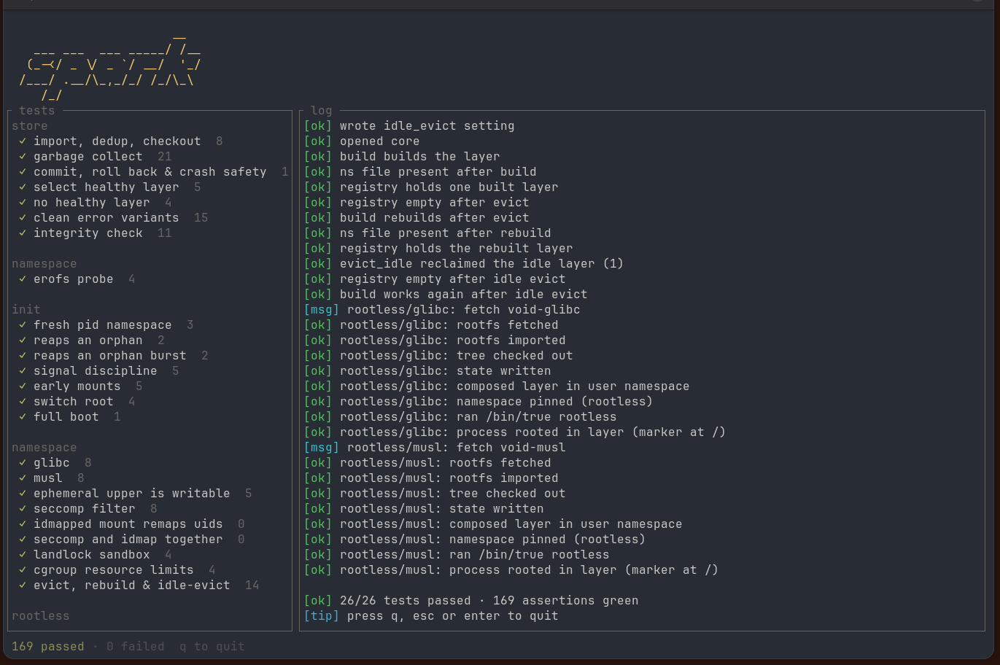

# spark

test suite for the nexus core

uses the public api against a live kernel inside throwaway sandboxes. not mocks -
real mount, pid, cgroup and user namespaces at full speed

## what it tests

- shadowed layer (glibc/musl) - full compose and run
- content-addressed store - import, checkout, verify, gc
- generations - commit, activate, rollback
- overlay and erofs backends
- sandbox - landlock, seccomp, capabilities, idmap
- cgroup v2 resource limits
- init path - pid-1 boot, reaper, signal block, handoff, switch_root
- error paths - unknown layer, corrupt store, bad nexus config
- user namespaces / rootless mode
- concurrent imports converge

## license

GPL-2.0
